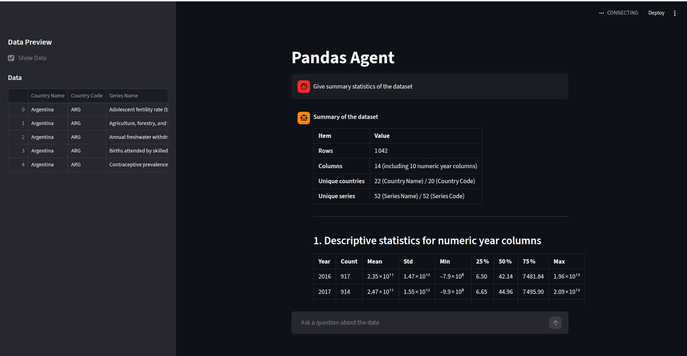
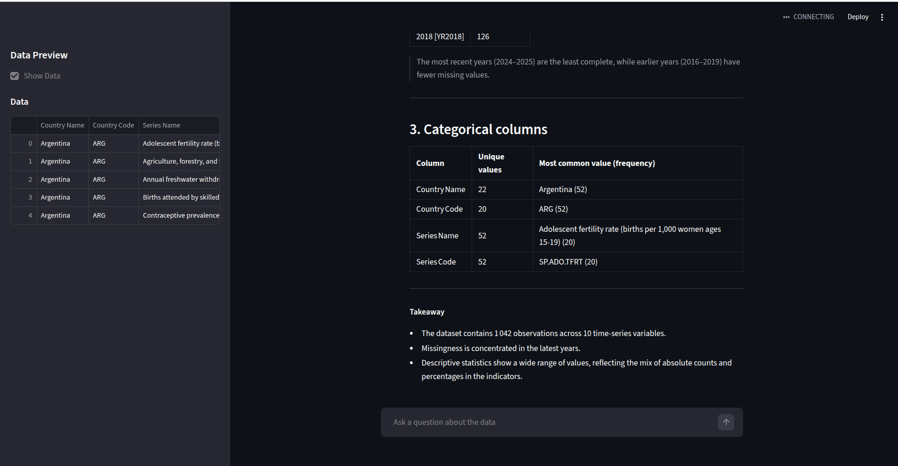

# Hybrid / Semantic Caching with Pandas Agent: Caching for GenAI Systems

## Architecture Diagram


## Application Screenshot



## How to run

- Create a `.env` file and add `GROQ_API_KEY` Then change the dataset

---
Run ```sh
streamlit run app.py
```